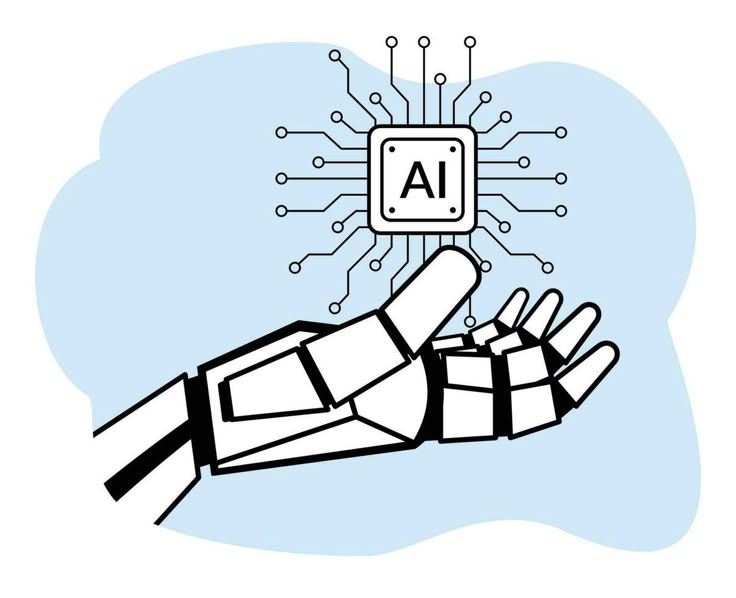

# Deep Learning - ISTEA

Este repositorio contiene los contenidos y prácticas desarrolladas en la materia de Aprendizaje Automático II. Abarca desde técnicas fundamentales hasta aplicaciones avanzadas en el procesamiento de lenguaje natural e imágenes.



## Contenidos

### 1. Procesamiento del Lenguaje Natural (NLP)

- Tokenización, radicalización y lematización.
- Etiquetado de partes del discurso (POS tagging).
- Reconocimiento de entidades nombradas (NER).
- Modelos de embeddings y representación vectorial.
- Transformers y sus aplicaciones en NLP.

### 2. Procesamiento Digital de Imágenes

- Operaciones puntuales en el dominio espacial.
- Filtrado espacial y manejo del color.
- Transformaciones geométricas.

### 3. Técnicas Clásicas de Reconocimiento de Imágenes

- Modelos de detección de objetos (HOG, SIFT, otros).
- Reconocimiento de entidades en imágenes.
- Clasificación de imágenes con métodos clásicos (SVM, KNN, otros).

### 4. Aprendizaje Profundo Aplicado a Imágenes

- Redes neuronales tipo perceptrón y profundas.
- Detección de objetos y segmentación semántica.
- Reconocimiento y clasificación de imágenes.
- Transferencia de aprendizaje.
- Fotografía computacional: generación de imágenes y transferencia de estilo.

## Requisitos

- Python 3.x
- TensorFlow / PyTorch
- OpenCV
- Scikit-learn
- NLTK / SpaCy

## Instalación

Clona el repositorio y usa un entorno virtual:
```bash
# Clonar el repositorio
git clone https://github.com/gdiazistea/dl_istea.git
cd dl_istea

# Crear un entorno virtual e instalar dependencias
python -m venv venv
source venv/bin/activate  # En Windows: venv\Scripts\activate
pip install -r requirements.txt
```

## Uso

Cada módulo cuenta con notebooks explicativos y scripts de implementación. Revisa la carpeta `nbs/` para ejemplos detallados.